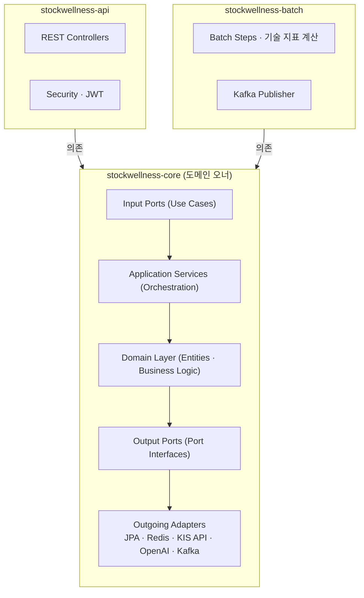
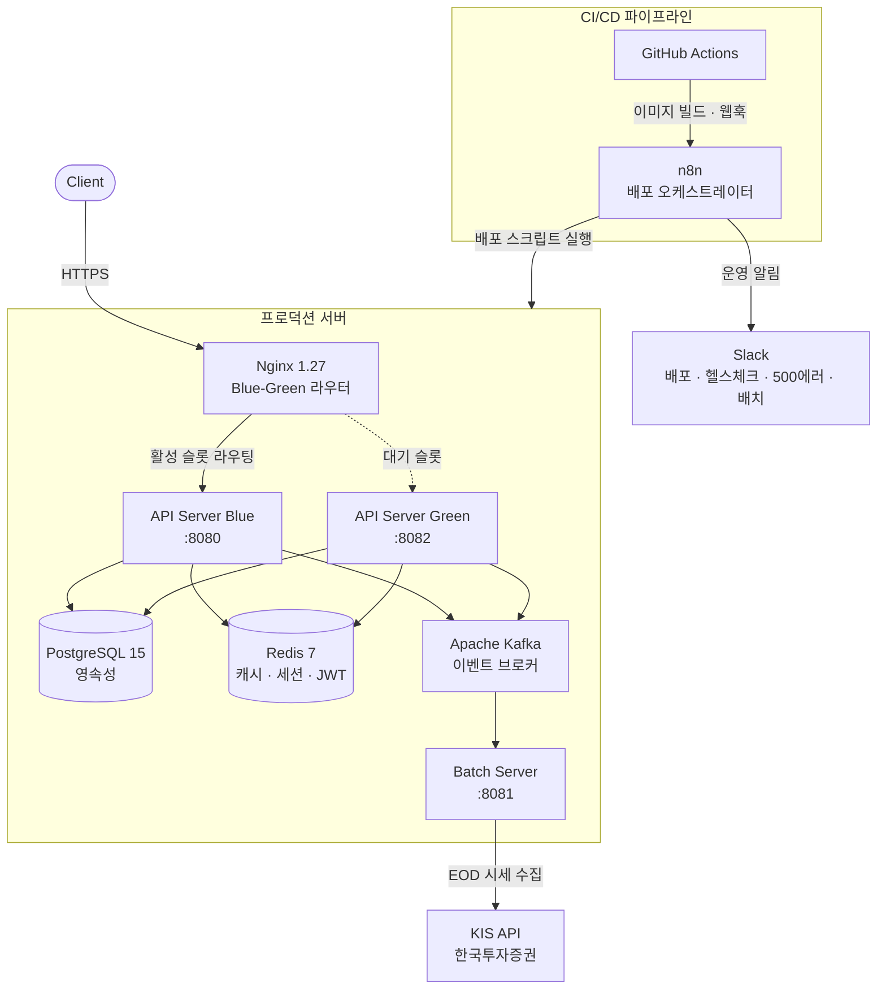
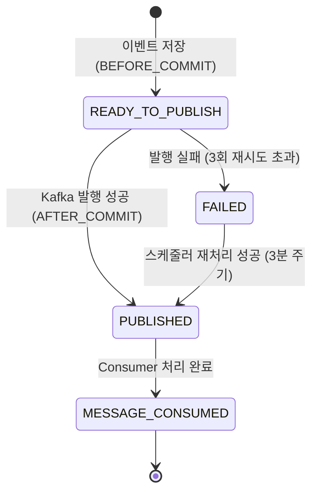
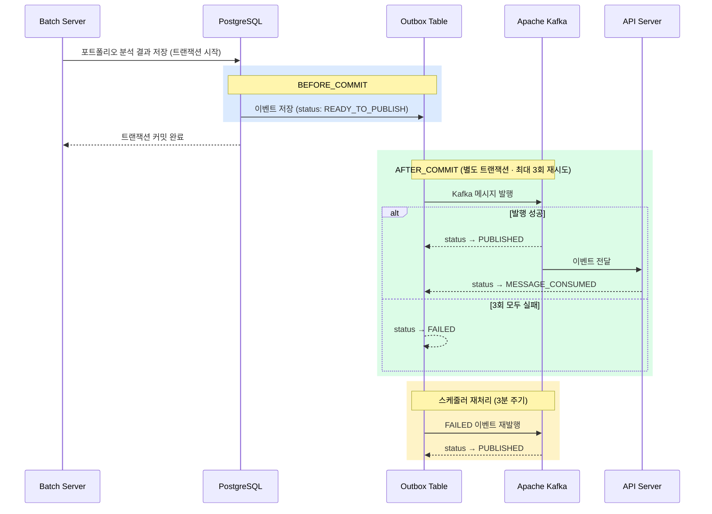

<h1 align="center">$\bf{\large{\color{#2EBE7A} Stockwellness \ Backend \ Server }}$</h1>

> 개인 투자자를 위한 자산 배분 시뮬레이터 및 AI 기반 투자 분석 서비스.
> 감정적 거래를 데이터 기반 의사결정으로 대체하는 것이 핵심 가치입니다.

## 개발 환경

성능 측정 가이드는 [k6/README.md](./k6/README.md)를 참고합니다.
백엔드 개발 작업 가이드는 [backend-development-guide.md](documents/backend-development-guide.md)를 참고합니다.

### Language


### Framework


### Database


### Infra & Messaging


### AI


### DevOps & CI/CD


<hr>

## Key Dependencies and Features

### 1. Pragmatic Hexagonal Architecture + DDD
- 멀티 모듈 구조로 도메인 책임을 `stockwellness-core`, `stockwellness-api`, `stockwellness-batch`로 분리
- `core`가 모든 도메인 엔티티와 비즈니스 로직을 소유하고, `api`·`batch`는 얇은 어댑터 역할만 수행
- Ports & Adapters 패턴으로 외부 의존성(DB, Redis, KIS API, OpenAI)을 도메인으로부터 격리

### 2. Transactional Outbox Pattern
- 포트폴리오 분석 완료 이벤트를 DB 저장과 Kafka 발행이 원자적으로 처리되도록 보장
- `BEFORE_COMMIT` 단계에서 Outbox 테이블에 이벤트 저장, `AFTER_COMMIT` 단계에서 Kafka 발행
- 발행 실패 시 `FAILED` 상태로 전환, 스케줄러가 주기적으로 재처리

### 3. Spring Batch 기반 EOD 데이터 파이프라인
- 매 영업일 장 마감 후 한국투자증권 KIS API에서 일일 시세(EOD) 수집
- RSI, MACD 등 기술 지표를 배치 단계에서 사전 계산하여 저장 (ta4j 활용)
- Virtual Threads 기반 병렬 처리로 대량 종목 데이터 수집 속도 최적화

### 4. PortfolioFacade 기반 통합 오케스트레이션
- 포트폴리오 백테스트, 건강 진단(MDD·Sharpe·Beta), 리밸런싱, AI 어드바이저를 단일 Facade로 통합
- 거치식/적립식(DCA) 전략 모두 지원하는 백테스트 시뮬레이터
- 자산군·업종·국가별 분산 분석 및 종목 간 상관관계 행렬 제공

### 5. AI 리밸런싱 어드바이저
- OpenAI GPT-4o-mini와 Spring AI 연동으로 포트폴리오 분석 결과 기반 투자 조언 생성
- BeanOutputConverter로 JSON 구조화 응답, 재시도 3회 및 Temperature 0.3으로 일관성 보장

### 6. 계층적 캐싱 전략
- Redis를 활용한 EOD 시세, 세션, JWT 다단계 캐싱
- `@Cacheable` + RedisTemplate 조합으로 외부 API 호출 최소화

### 7. Blue-Green 무중단 배포
- Nginx upstream 블록 교체 + `nginx -s reload`로 트래픽 전환 (다운타임 0)
- n8n 워크플로우가 GitHub Actions 웹훅을 수신해 배포 스크립트 자동 실행
- 배포 결과·서버 헬스체크·API 500 에러·배치 실행 결과를 Slack으로 알림

<hr>

## 아키텍처

### 소프트웨어 아키텍처

본 시스템은 **Pragmatic Hexagonal Architecture**와 **DDD**를 결합한 멀티 모듈 구조로 설계되어 있습니다.
도메인 핵심 로직은 `stockwellness-core`가 단독으로 소유하며, 외부 어댑터(`api`, `batch`)는 `core`에 의존하되 서로 간 의존은 금지됩니다.



| 모듈 | 역할 |
|---|---|
| **stockwellness-core** | 도메인 엔티티, 비즈니스 로직, 영속성 어댑터, 외부 API 어댑터, Redis 어댑터, 포트 인터페이스 |
| **stockwellness-api** | REST 컨트롤러, JWT 처리, Security 설정 |
| **stockwellness-batch** | 시세 수집 배치 스텝, 기술 지표 계산, Kafka 이벤트 발행 |

### 시스템 아키텍처



### Transactional Outbox Pattern

MSA 환경에서 배치 서버와 API 서버 간 데이터 정합성을 보장하기 위해 Transactional Outbox Pattern을 적용했습니다.
DB 저장과 Kafka 메시지 발행을 단일 트랜잭션으로 묶어 유실 없는 이벤트 전달을 보장합니다.

#### Outbox 상태 흐름



#### Outbox 예시

| 필드 | 값 |
|---|---|
| `id` | a3f1c2d4-84be-4b2e-9f10-abc123def456 |
| `aggregate_type` | Portfolio |
| `event_type` | PortfolioAnalysisCompleted |
| `payload` | `{ "portfolioId": 42, "memberId": 7, "analysisType": "HEALTH" }` |
| `timestamp` | 2026-03-24 09:30:00.000 |
| `status` | READY_TO_PUBLISH |

#### 패턴 흐름



#### BEFORE_COMMIT — Outbox 저장

```java
@TransactionalEventListener(phase = TransactionPhase.BEFORE_COMMIT)
public void handleOutboxEvent(OutboxEvent event) {
    outboxService.saveNewOutboxProcess(event);
}
```

#### AFTER_COMMIT — Kafka 발행

```java
@TransactionalEventListener(phase = TransactionPhase.AFTER_COMMIT)
@Transactional(propagation = Propagation.REQUIRES_NEW)
@Retryable(
    retryFor = { KafkaSendException.class },
    maxAttempts = 3,
    backoff = @Backoff(delay = 2000),
    recover = "recover"
)
public void handleKafkaEvent(OutboxEvent event) {
    // Kafka 메시지 발행 후 status → PUBLISHED
}
```

#### 실패 이벤트 재처리 — Scheduler

```java
@Scheduled(fixedDelay = 60000 * 3) // 3분마다
public void retryFailedMessages() {
    List<Outbox> failedEvents = outboxService.getFailedOutboxEvents();
    for (Outbox outbox : failedEvents) {
        try {
            kafkaTemplate.send(topic, outbox.getPayload());
        } catch (Exception e) {
            log.error("Kafka 재처리 실패, eventId: {}", outbox.getId(), e);
        }
    }
}
```

<hr>

## Component & API URI Collection

### Auth Component

소셜 로그인(OAuth2) 기반 인증 및 JWT 토큰 관리를 담당하는 컴포넌트

| URI | Method | 설명 |
|---|---|---|
| `/api/v1/auth/login` | POST | 소셜 로그인 (Kakao · Google OAuth2) |
| `/api/v1/auth/reissue` | POST | Access Token 재발급 |
| `/api/v1/auth/logout` | POST | 로그아웃 (Refresh Token 무효화) |

<br>

### Member Component

회원 정보 조회·수정·탈퇴 및 알림 설정을 관리하는 컴포넌트

| URI | Method | 설명 |
|---|---|---|
| `/api/v1/members/me` | GET | 내 정보 조회 |
| `/api/v1/members/me` | PUT | 내 정보 수정 |
| `/api/v1/members/me` | DELETE | 회원 탈퇴 |
| `/api/v1/members/me/notifications` | GET | 알림 설정 조회 |
| `/api/v1/members/me/notifications` | PUT | 알림 설정 변경 |

<br>

### Portfolio Component

포트폴리오 CRUD 및 건강 진단·AI 리밸런싱 어드바이저를 담당하는 컴포넌트

| URI | Method | 설명 |
|---|---|---|
| `/api/v1/portfolios` | POST | 포트폴리오 생성 |
| `/api/v1/portfolios` | GET | 내 포트폴리오 목록 조회 |
| `/api/v1/portfolios/{portfolioId}` | GET | 포트폴리오 상세 조회 |
| `/api/v1/portfolios/{portfolioId}` | PUT | 포트폴리오 수정 (구성 종목 변경) |
| `/api/v1/portfolios/{portfolioId}` | DELETE | 포트폴리오 삭제 |
| `/api/v1/portfolios/{portfolioId}/health` | GET | 포트폴리오 건강 진단 (MDD · Sharpe · Beta) |
| `/api/v1/portfolios/{portfolioId}/advice/latest` | GET | 최신 AI 리밸런싱 조언 조회 |

<br>

### Portfolio Analysis Component

백테스트, 성과 분석, 비중 분석, 리밸런싱 가이드를 담당하는 컴포넌트

| URI | Method | 설명 |
|---|---|---|
| `/api/v1/portfolios/{portfolioId}/analysis/valuation` | GET | 성과 분석 (평가 가치 및 수익률) |
| `/api/v1/portfolios/{portfolioId}/analysis/diversification` | GET | 비중 분석 (자산군 · 업종 · 국가) |
| `/api/v1/portfolios/{portfolioId}/analysis/rebalancing` | GET | 리밸런싱 가이드 조회 |
| `/api/v1/portfolios/{portfolioId}/analysis/summary` | GET | 분석 요약 정보 조회 |
| `/api/v1/portfolios/{portfolioId}/analysis/backtest` | POST | 백테스트 시뮬레이션 (거치식 · DCA) |
| `/api/v1/portfolios/{portfolioId}/analysis/correlation` | GET | 종목 간 상관관계 행렬 조회 |

<br>

### Stock Component

종목 탐색, 기본 정보, 시세 차트, 수익률 데이터를 제공하는 컴포넌트

| URI | Method | 설명 |
|---|---|---|
| `/api/v1/stocks/search` | GET | 통합 종목 검색 (키워드 · 시장 · 상태 필터) |
| `/api/v1/stocks/search/history` | GET | 최근 검색어 조회 |
| `/api/v1/stocks/search/history` | DELETE | 최근 검색어 개별 삭제 |
| `/api/v1/stocks/search/history/all` | DELETE | 최근 검색어 전체 삭제 |
| `/api/v1/stocks/popular-search` | GET | 인기 검색어 Top 10 조회 |
| `/api/v1/stocks/new-listings` | GET | 신규 상장 종목 조회 |
| `/api/v1/stocks/{ticker}` | GET | 종목 상세 정보 조회 |
| `/api/v1/stocks/{ticker}/prices/history` | GET | 차트용 과거 가격 데이터 조회 (기간 · 주기 선택) |
| `/api/v1/stocks/{ticker}/returns` | GET | 기간별 수익률 및 벤치마크 대비 수익률 조회 |

<br>

### Sector Component

섹터 랭킹, 수급 분석, 섹터 상세 및 시장 비교를 제공하는 컴포넌트

| URI | Method | 설명 |
|---|---|---|
| `/api/v1/sectors/ranking/fluctuation` | GET | 등락률 상위 섹터 조회 |
| `/api/v1/sectors/ranking/supply` | GET | 수급 상위 섹터 조회 |
| `/api/v1/sectors/{sectorCode}/detail` | GET | 섹터 상세 및 진단 정보 조회 |
| `/api/v1/sectors/{sectorCode}/comparison` | GET | 섹터 vs 시장 비교 분석 조회 |

<br>

### Market Component

시장 지수 데이터를 제공하는 컴포넌트

| URI | Method | 설명 |
|---|---|---|
| `/api/v1/market/indexes` | GET | 시장 지수 조회 (KOSPI · KOSDAQ · S&P500) |

<br>

### Watchlist Component

관심 종목 그룹 및 종목 항목을 관리하는 컴포넌트

| URI | Method | 설명 |
|---|---|---|
| `/api/v1/watchlist/groups` | POST | 관심 종목 그룹 생성 |
| `/api/v1/watchlist/groups` | GET | 내 관심 종목 그룹 목록 조회 |
| `/api/v1/watchlist/groups/{groupId}` | PATCH | 그룹명 수정 |
| `/api/v1/watchlist/groups/{groupId}` | DELETE | 그룹 삭제 |
| `/api/v1/watchlist/groups/{groupId}/items` | POST | 그룹에 종목 추가 |
| `/api/v1/watchlist/groups/{groupId}/items` | GET | 그룹 내 종목 목록 조회 |
| `/api/v1/watchlist/groups/{groupId}/items/{ticker}` | DELETE | 그룹에서 종목 제거 |
| `/api/v1/watchlist/groups/{groupId}/items/{ticker}/note` | PATCH | 종목 메모 수정 |
