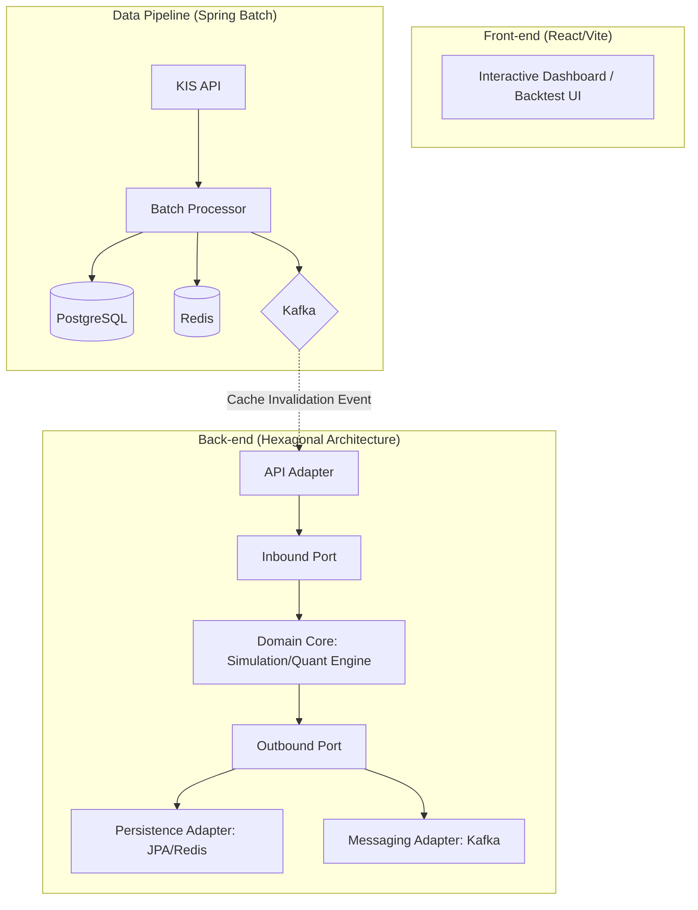

# 📊 StockWellness Portfolio & Resume Guide

본 문서는 StockWellness 프로젝트를 바탕으로 **핀테크/금융권 백엔드 개발자** 지원을 위한 이력서 및 포트폴리오 작성을 돕기 위해 생성되었습니다.

---

## 📄 PART 1. Notion 이력서 (Resume) 전용 문구

### 1. 자기소개 (Summary)
> **"아키텍처의 견고함과 데이터의 정합성을 고민하는, 품질 중심의 풀스택 개발자"**
> - **Java 21 Virtual Threads**를 활용한 고성능 비동기 처리 및 시스템 최적화 경험 보유.
> - **Hexagonal Architecture**와 **TDD**를 통해 인프라에 독립적인 견고한 비즈니스 로직 설계 지향.
> - **Spring Batch & Redis** 기반의 대량 데이터 파이프라인 구축 및 실시간 시각화 UI 구현.
> - **GitHub Actions & Playwright**를 이용한 전 계층 테스트 자동화 및 안정적인 서비스 운영 역량.

### 2. 핵심 프로젝트 성과 (Key Achievements - STAR 기법)

#### 🚀 StockWellness: AI 기반 자산 배분 시뮬레이션 서비스 (Full-stack)
- **[성능] Java 21 가상 스레드 기반 고성능 자산 배분 시뮬레이터 구축**
  - **Problem**: 외부 API(KIS) 호출 및 퀀트 연산 시 Platform Thread의 I/O 차단으로 인한 확장성 한계 발견.
  - **Action**: Java 21 **Virtual Threads** 도입 및 React 기반 인터랙티브 UI 설계로 비동기 처리량 극대화.
  - **Result**: 초고속 백테스트 시뮬레이션 환경 구축 및 실시간 리밸런싱 피드백 시스템 구현.

- **[아키텍처] 헥사고날 아키텍처 도입 및 전 계층 테스트 자동화**
  - **Problem**: 기술적 상세 구현(JPA, API)과 비즈니스 로직의 강한 결합으로 인한 테스트 및 유지보수 어려움 해결 필요.
  - **Action**: **헥사고날 아키텍처**로 도메인 로직 격리 및 **JUnit(BE), Playwright/Vitest(FE)** 테스트 자동화 구축.
  - **Result**: 인프라 환경과 독립된 순수 도메인 검증 환경 확보 및 배포 안정성 획기적 개선.

- **[데이터] Spring Batch & Redis를 활용한 대규모 시세 시각화 최적화**
  - **Problem**: 수백만 건의 종가 데이터 및 지표 조회 시 발생하는 DB 부하와 응답 속도 저하 문제 해결 필요.
  - **Action**: **Spring Batch**의 Chunk 기반 처리로 지표 사전 계산 자동화 및 **Redis 계층형 캐싱** 적용.
  - **Result**: 복잡한 금융 지표를 ms 단위의 응답 속도로 서빙하여 사용자 만족도 제고 및 시스템 안정성 확보.

### 3. 기술적 인사이트 (Technical Insights / Troubleshooting)
- **[안정성] 제네릭 타입 안정성 확보**: `Unchecked cast` 경고를 방치하지 않고 Port 인터페이스 시그니처 개선을 통해 런타임 타입 에러 가능성을 원천 차단.
- **[미래 호환성] 빌드 스크립트 현대화**: Gradle 10 로드맵에 맞춘 Deprecated API 제거 및 Configuration Cache 대응을 통해 빌드 성능 최적화.
- **[정합성] 분산 환경 데이터 동기화**: Kafka 기반의 이벤트 전파를 통해 배치 서버와 API 서버 간의 캐시 불일치 문제를 해결하고 시스템 간 결합도를 낮춤.

---

## 🏠 PART 2. GitHub README (Project Detail) 마크다운

```markdown
# 🚀 StockWellness: AI 기반 자산 배분 시뮬레이션 및 포트폴리오 헬스케어

> **"감정에 휘둘리는 투자를 넘어, 데이터 기반의 이성적인 의사결정으로"**
>
> StockWellness는 Java 21 가상 스레드와 헥사고날 아키텍처를 기반으로 구축된 고성능 자산 배분 시뮬레이션 및 AI 진단 서비스입니다. 대량의 금융 데이터를 안정적으로 처리하고, 복잡한 퀀트 분석 결과를 직관적인 대시보드로 제공합니다.

---

## 🏗 System Architecture (Hexagonal)

본 프로젝트는 **도메인 중심 설계(DDD)**와 **헥사고날 아키텍처**를 채택하여 기술적 상세 구현과 비즈니스 로직을 철저히 분리했습니다.



---

## 💡 Engineering Deep Dive (핵심 기술 챌린지)

### ⚡ Java 21 Virtual Threads 기반의 고성능 비동기 처리
*   **Challenge**: 외부 시세 API(KIS) 호출 및 대량의 퀀트 연산 시, 기존 Platform Thread 방식은 I/O 차단으로 인한 확장성 한계 및 리소스 낭비가 발생함.
*   **Solution**: Java 21 **Virtual Threads**를 도입하여 I/O 차단 구간의 리소스 점유율 최적화. 수천 개의 종목 시뮬레이션을 동시에 처리할 수 있는 고용량 파이프라인 구축.
*   **Impact**: 서버 리소스 사용 효율 극대화 및 사용자에게 지연 없는 실시간 백테스트 피드백 제공.

### 🧩 도메인 순수성을 보장하는 헥사고날 아키텍처 및 TDD
*   **Challenge**: 금융 도메인 로직의 복잡성이 증가함에 따라, 외부 기술(JPA, API)과의 결합도를 낮추고 로직의 정합성을 독립적으로 검증해야 했음.
*   **Solution**: **헥사고날 아키텍처**로 도메인 계층을 격리하고, 의존성 역전(DIP)을 통해 인프라와 로직을 분리.
*   **Quality**: 백엔드(JUnit 5) 및 프론트엔드(Playwright, Vitest) 전 계층 테스트 자동화를 통해 금융 데이터 신뢰성 확보.

### 📊 Spring Batch & Redis 기반의 계층형 시세 캐싱
*   **Challenge**: 대량의 종가 데이터 및 기술적 지표(RSI, MACD) 조회 시 발생하는 DB 부하와 응답 속도 저하 문제 해결 필요.
*   **Solution**: **Spring Batch**의 Chunk 기반 처리로 지표를 사전 계산(Pre-calculation)하고, **Redis**를 활용한 계층형 캐싱 전략(Hot/Cold Data 분리) 적용.
*   **Impact**: 복잡한 금융 지표를 ms 단위의 응답 속도로 서빙하여 실시간 대시보드 사용자 경험 완성.

### 🔗 Kafka를 활용한 분산 데이터 정합성 보장
*   **Challenge**: 배치 서버와 API 서버가 분리된 멀티 모듈 환경에서 데이터 업데이트 시 캐시 불일치 문제 발생 가능성 존재.
*   **Solution**: **Kafka**를 통해 수집 완료 이벤트를 전파하고, **Transactional Outbox 패턴**을 적용하여 DB 저장과 메시지 발행의 원자성 확보.

---

## 🎨 Visual Showcase (UI/UX)

- **기술 분석 대시보드**: Redis에서 고속 서빙되는 퀀트 지표(RSI, MACD 등)를 실시간 차트로 시각화.
- **자산 배분 시뮬레이터**: 사용자가 직접 비중을 조절하며 Virtual Threads 기반의 백테스트 결과를 즉각 확인.
- **AI 리밸런싱 어드바이저**: Spring AI와 연동하여 현재 시장 상황에 맞는 최적의 비중 조절 조언 제공.
```
